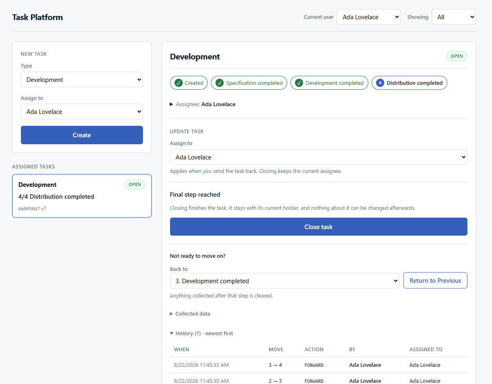

# Extensible Task Management Platform

A task-management system built so that **adding a new task type requires adding files, not changing them** — on the server *and* the client.

Node.js · TypeScript · Express · TypeORM · PostgreSQL · React



The task view keeps one decision in one place — who takes the task next, then the single
action that moves it on — with the assignee stated once above both, because it is part of
the same submission. The progress tracker across the top is drawn from the task type's own
status ladder, completed steps carrying a ✓, and every field below it is rendered from
server metadata rather than from anything the client knows about procurement or
development. Technical details collapse out of the way behind the assignee line, and the
audit log reads newest-first, recording who *performed* each transition separately from who
*received* the task.

---

## Quick start

```bash
git clone https://github.com/galhrn/dnb-task-platform.git && cd dnb-task-platform
cp .env.example .env
docker compose up -d          # PostgreSQL 16
npm install                   # npm workspaces — installs api + web + contracts
npm run migration:run
npm run seed                  # demo users
npm run dev                   # api :3000, web :5173
```

Then open <http://localhost:5173>. `npm run dev` runs the API on :3000 and the client on
:5173; the client proxies `/api` to the API, so the browser only ever sees one origin.

Useful afterwards:

```bash
npm test          # 191 unit tests, no container needed
npm run test:int  #  52 integration tests, needs the database
npm run db:reset  # drop the volume and start clean
```

Every request in the API lives in [`requests.http`](requests.http) - one per endpoint and one
per error code, runnable from VS Code's REST Client or copyable into curl.

---

## The one thing to look at

The assignment asks how a third task type would be added without touching existing code. Here is the whole answer:

```ts
// apps/api/src/domain/task-types/procurement.task-type.ts - the whole file,
// reflowed to fit this page
export const procurementTaskType: TaskTypeDefinition = {
  type: 'PROCUREMENT',
  label: 'Procurement',
  statuses: [
    { name: 'Created', fields: [] },
    {
      name: 'Supplier offers received',
      fields: [
        { kind: 'string-array', name: 'quotes', label: 'Supplier quotes',
          required: true, minItems: 2, maxItems: 2, itemMinLength: 1 },
      ],
    },
    {
      name: 'Purchase completed',
      fields: [
        { kind: 'string', name: 'receipt', label: 'Receipt', required: true, minLength: 1 },
      ],
    },
  ],
};
```

That is the entire type-specific half of the system. Note what is *absent*: no final-status
constant (it is `statuses.length`), no transition table (forward is `+1`, backward is
anything lower), no validation code (the descriptors compile to it), and no mention of
this type anywhere in the engine, the use cases, the routes, or the client.

To add a type:

1. Add `apps/api/src/domain/task-types/<name>.task-type.ts`.
2. Add one line to `apps/api/src/domain/task-types/index.ts`.

No migration. No change to the workflow engine, use cases, routes, or any frontend file.

**This is demonstrated, not asserted.** The `MARKETING` task type was added as the final
commit on `main`, on its own, after everything else was finished. See exactly what it took:

```bash
git log --oneline -1        # the commit
git show --stat HEAD        # its diff: two files, no frontend, no migration
```

The ordering is deliberate. Documentation, polish and the client were all finished first, so
that the last commit contains nothing but the new task type - there is no way to claim the
diff was kept small by leaving work out of it.

---

## Architecture

```
interfaces/http  ──►  application  ──►  domain
        │                  │
        └──────────────────┴──────►  infrastructure (via ports)
```

**Dependency rule: `interfaces → application → domain`, never the reverse.** The `domain/` directory imports no framework — it is plain TypeScript operating on plain objects, and its tests run without a database, an HTTP server, or a container.

| Layer | Responsibility |
|---|---|
| `domain/` | Workflow engine (the general rules), task-type definitions (the specific rules), registry |
| `application/` | Use cases, transaction boundaries, repository *ports* |
| `infrastructure/` | TypeORM entities, repository implementations, migrations, seeds |
| `interfaces/http/` | Express routes, request parsing, error mapping, composition root |

### The separation the assignment asks for

The workflow engine enforces sequencing, closure and assignment. **It has never heard of "procurement."** A task type contributes only two things: an ordered list of statuses, and the data required to *enter* each one. The final status is derived from the list's length, so "close only at the final status" is generic code.

There is no `switch (task.type)` anywhere in the codebase.

Checked, not assumed:

```bash
$ grep -rnE "task\.type\s*===|switch\s*\(\s*[a-z]*\.?type\s*\)" apps/api/src --include='*.ts'
$                       # no matches
```

Neither side branches on a task type, and both sides have a test that fails if one ever does:
[`purity.test.ts`](apps/api/src/domain/purity.test.ts) reads every import in `domain/` and
rejects anything outside Zod and the type-only contracts package, while
[`no-task-type-knowledge.test.ts`](apps/web/src/no-task-type-knowledge.test.ts) reads every
client source file and rejects any mention of a task type, of a field belonging to one, or of
a comparison between a type and a literal. Both were mutation-checked - deliberately broken to
confirm they fail - because a structural test that has never been red proves nothing.

### Dependency injection without a framework

Express was chosen over NestJS deliberately. Nest's multi-provider DI would register strategies with less code, but it would also hide the mechanism being evaluated. Here the registry is a `Map` and the wiring is a single composition root file you can read top to bottom.

---

## Design decisions & trade-offs

Each of these had a rejected alternative. Full log in `project_context.md` §11.

### Storing type-specific data: JSONB, not table-per-type

`tasks.data` is a `jsonb` column keyed by status. Table-per-type was rejected because it requires a migration for every new type — which defeats the assignment's central question. EAV was rejected on query ergonomics.

The trade-off is real: JSONB gives no database-level shape guarantee. It is mitigated by funnelling every write through a single validation boundary, where the type's own schema is applied.

### An append-only transition log

`task_transitions` records every create, move and close: from-status, to-status, the data
supplied, who received the task, and who performed the transition. `tasks.data` is a **read
projection**; the transition table is the source of truth.

The last two are deliberately separate fields. `assignedUserId` answers *who has it now*,
which is not *who did this* - they differ on every handover, and a `CLOSE` hands the task to
nobody, so without an actor the log cannot say who closed it. Deriving the actor from the
previous holder was rejected: the API lets anyone move anyone's task, so that inference is
wrong precisely when an audit matters.

Since there is no authentication (see Scope), the actor is **self-asserted by the caller** -
provenance, not proof. Worth stating plainly rather than letting the column imply more than it
can deliver. Adding auth later means taking the actor from the session instead of the body;
nothing else moves.

This falls out of the spec — rule 7 requires recording the next assigned user on every change — and it makes the backward-move question tractable: clearing projected data destroys no history.

### Backward moves clear forward data

Moving from status 3 back to 2 discards the data collected for status 3. Re-advancing requires supplying it again. The stricter reading, and the transition log means nothing is lost.

### Concurrency

Status changes run in a transaction against a versioned row. Concurrent modification returns
`409 VERSION_CONFLICT` rather than silently losing a write.

The write is a conditional `UPDATE ... WHERE id = $1 AND version = $2 RETURNING *`, guarded
with the version the request read — so a lost update is impossible even when the client sends
no `expectedVersion`. It is *not* `repository.save()`: the integration suite was written
assuming TypeORM enforced `@VersionColumn` on save, and it demonstrated the opposite — a stale
write succeeded, and saving a deleted row re-inserted it. That test is still there, and it is
the reason this layer is verified against a real database rather than a double.

### Field kinds are a lookup table, not a Strategy pattern

Field descriptors compile to Zod schemas through a `Record<FieldKind, builder>` in
`field-schema.ts` — five entries, one per primitive: `string`, `number`, `boolean`, `date`,
`string-array`. No strategy interface, no per-kind class, no registration, no injection.

That is a deliberate asymmetry with how **task types** are handled two files away, and the
reasoning is worth stating because the two look superficially similar.

**Open/Closed is applied to the axis that actually changes.** The assignment's question is
"how do you add a task type without touching existing code", so task types get the full
treatment: a definition per file, a registry, and an `index.ts` whose only job is a list.
Adding one modifies nothing. That axis is open because the requirement says it is open.

**Field kinds are a different axis, and it is closed.** The primitive vocabulary of a form
field is not a moving target — it is roughly the set JSON already has. It changes about
once a project, by a developer, in a pull request. Modelling it as an extension point
would mean an interface per primitive, a plugin registry to discover implementations, and
a DI container to wire them: more indirection and more files to serve a set that will not
move, and it would scatter the descriptor vocabulary across the codebase — which is
exactly the drift ADR-009 exists to prevent by making descriptors the single source of
truth.

**The lookup table gives up nothing the `switch` had.** Its type is
`{ [K in FieldKind]: FieldSchemaBuilder<K> }`, so a new kind with no builder is a
*compile* error, and each builder still receives its own narrowed descriptor type. It is
a dispatch table, not a conditional — there is no branch to fall through and nothing to
forget.

**And the pressure valve is elsewhere.** The thing that genuinely varies per task type is
*rules*, not primitives — "quote B must be lower than quote A", "this date must follow
that one". Those go in a type's optional `onEnter` hook, which is opt-in composition on
the definition itself. Because that hatch exists, the vocabulary never needs to grow to
express a rule, so it stays small on purpose.

**The trade-off, stated plainly.** If field kinds ever became *runtime*-extensible — a
form builder, tenant-defined fields, kinds loaded from configuration — this decision
inverts and a real plugin boundary earns its keep. Nothing in the current design would
have to be unpicked to get there: the table is already the seam. Until that requirement
exists, building for it would be over-engineering, and a reviewer would be right to say
so. (`project_context.md` ADR-014.)

---

## API

Base path `/api`.

| Method | Path | Purpose |
|---|---|---|
| `GET` | `/task-types` | Type metadata — statuses and required fields. Drives the client's forms. |
| `POST` | `/tasks` | Create with a type and an initial assignee |
| `GET` | `/tasks/:id` | Task with its transition history |
| `POST` | `/tasks/:id/transitions` | Change status — direction is derived, not declared |
| `POST` | `/tasks/:id/close` | Close, permitted only at the final status |
| `GET` | `/users/:id/tasks` | Tasks assigned to a user |
| `GET` | `/users` | Seeded demo users |

### Worked examples

Every response below is real output from the running service.

```bash
# The metadata that drives the client's forms. Adding a task type changes this
# payload and nothing else.
curl localhost:3000/api/task-types

# Create. 201 with the task.
curl -X POST localhost:3000/api/tasks -H 'Content-Type: application/json' \
  -d '{"type":"PROCUREMENT","assignedUserId":"1111...","actorUserId":"1111..."}'
```
```json
{"id":"b9810de1-...","type":"PROCUREMENT","status":1,"state":"OPEN",
 "assignedUserId":"11111111-...","data":{},"version":1,
 "createdAt":"2026-08-21T10:03:06.114Z","updatedAt":"2026-08-21T10:03:06.114Z"}
```

```bash
# Move forward. Direction is derived from toStatus, never declared.
curl -X POST localhost:3000/api/tasks/$ID/transitions -H 'Content-Type: application/json' \
  -d '{"toStatus":2,"assignedUserId":"2222...","actorUserId":"1111...",
       "data":{"quotes":["A-100","B-90"]}}'
```
```json
{"id":"b9810de1-...","status":2,"state":"OPEN","data":{"2":{"quotes":["A-100","B-90"]}},
 "version":2,"updatedAt":"2026-08-21T10:03:06.338Z"}
```

```bash
# Out of range -> 409, and the message is derived from the type's own ladder.
curl -X POST localhost:3000/api/tasks/$ID/transitions -H 'Content-Type: application/json' \
  -d '{"toStatus":9,"assignedUserId":"1111...","actorUserId":"1111..."}'
```
```json
{"error":{"code":"INVALID_TRANSITION","message":"Status 9 is out of range for PROCUREMENT (1..3)"}}
```

```bash
# Entering a status without the data it requires -> 422, with the field named.
curl -X POST localhost:3000/api/tasks/$ID/transitions -H 'Content-Type: application/json' \
  -d '{"toStatus":3,"assignedUserId":"1111...","actorUserId":"1111..."}'
```
```json
{"error":{"code":"VALIDATION_FAILED",
  "message":"Status 3 of PROCUREMENT was not entered with the data it requires",
  "details":[{"path":"data.receipt","message":"Required"}]}}
```

```bash
# Close: only at the final status, and it names no new assignee (ADR-011) -
# but it does name an actor, because somebody closed it.
curl -X POST localhost:3000/api/tasks/$ID/close -H 'Content-Type: application/json'   -d '{"actorUserId":"1111..."}'

# A user's tasks - open and closed by default (ADR-012).
curl "localhost:3000/api/users/11111111-.../tasks?state=OPEN"

# The seeded users, for the assignee picker.
curl localhost:3000/api/users
```

### 400 or 422? The line this API draws

The request schema asks one question: **can a use case accept this?** Whether the request is
*allowed* is the workflow engine's call, and the two produce different statuses.

| Request | Status | Why |
|---|---|---|
| `toStatus: "two"` | `400` | not a number — unparseable |
| `toStatus: 2.5` | `409` | a number, but not a status (WF-3) |
| `toStatus: 99` | `409` | a status, but out of range for this type |
| `data: "quotes"` | `400` | not an object — wrong shape |
| `data: {}` | `422` | an object, but not the one this status requires |

Putting a task type's field rules into the request schema would create a second source of
truth that needs editing every time a type is added — the exact thing this architecture
exists to avoid.

### Errors

```json
{ "error": { "code": "INVALID_TRANSITION", "message": "...", "details": [] } }
```

| Code | HTTP |
|---|---|
| `BAD_REQUEST` | 400 |
| `NOT_FOUND` | 404 |
| `VALIDATION_FAILED` | 422 |
| `INVALID_TRANSITION` | 409 |
| `TASK_CLOSED` | 409 |
| `VERSION_CONFLICT` | 409 |
| `INTERNAL_ERROR` | 500 |

Domain errors carry a code; one middleware maps them to HTTP. Routes never build error bodies.

---

## Workflow rules

| # | Rule |
|---|---|
| 1 | Exactly one assignee at any moment |
| 2 | Open or Closed; closed tasks are immutable |
| 3 | Statuses are ascending integers from 1 |
| 4 | Forward moves are exactly one step |
| 5 | Backward moves may span any distance |
| 6 | Closure only from the final status |
| 7 | Every change satisfies the type's data requirements and records the next assignee |

Ambiguities in the spec, and how they were resolved:

- Required data is scoped to **entering** a status, so status 1 has no requirements.
- Backward moves also require an assignee — rule 7 says *every* status change.
- Moving to the current status is rejected, not treated as a no-op.
- Closing an already-closed task is an error, not idempotent success.

---

## Task types

Required data is scoped to **entering** a status, so status 1 never requires anything.

### Procurement — final status 3

| Status | Meaning | Required to enter |
|---|---|---|
| 1 | Created | — |
| 2 | Supplier offers received | `quotes`: exactly two non-empty strings |
| 3 | Purchase completed | `receipt`: non-empty string |

### Development — final status 4

| Status | Meaning | Required to enter |
|---|---|---|
| 1 | Created | — |
| 2 | Specification completed | `specification`: non-empty text (rendered as a textarea) |
| 3 | Development completed | `branchName`: non-empty string |
| 4 | Distribution completed | `version`: non-empty string |

### Marketing — final status 2

| Status | Meaning | Required to enter |
|---|---|---|
| 1 | Created | — |
| 2 | Campaign launched | `campaignUrl`: non-empty string |

Marketing is the extensibility proof, added last and alone. Two statuses is a third distinct
ladder length, so it exercises "the final status is the length of this list" rather than any
bound somebody happened to hard-code.

---

## Client

Minimal by instruction, but with one deliberate property: **the client has no per-type code either.** It fetches `GET /task-types` and renders forms from the returned field descriptors. Adding Marketing changed zero frontend files.

State is server state, managed with React Query — no global store.

There is no authentication (deliberately - see Scope), so the app acts as a seeded user.
The id is the single hard-coded value in the client:

```ts
// apps/web/src/pages/TasksPage.tsx
const DEFAULT_USER_ID = '11111111-1111-4111-8111-111111111111'; // Ada, from `npm run seed`
```

The header has an **Acting as** picker for the other seeded users. That is not a login - it
is the only way to watch a task change hands: advance a task and assign it to Grace, switch
to Grace, and it is now in her list and gone from Ada's.

### How a form gets on the screen

1. `GET /task-types` returns each type's statuses and the `FieldDescriptor[]` needed to enter
   each one.
2. `StatusControls` derives everything from that: the next status is `current + 1`, reverse
   targets are every status below, and close is offered only at `statuses.length`.
3. `DynamicFieldForm` renders the target status's descriptors - a `string-array` becomes
   repeatable inputs bounded by `minItems`/`maxItems`, a `multiline` string becomes a
   textarea, a `date` becomes `<input type="date">`.
4. A 422 comes back with `details` paths like `data.quotes.1`, and each field claims its own
   path, so server-side validation lands under the right input without the client knowing
   which fields exist.

No component names a task type, names a field belonging to one, or branches on either -
[`no-task-type-knowledge.test.ts`](apps/web/src/no-task-type-knowledge.test.ts) reads every
client source file and fails if one does. It must still pass unedited when Marketing lands.

---

## Testing

```bash
npm run test          # unit — domain, no database required
npm run test:int      # integration — requires docker compose up
```

The domain suite covers each of the seven workflow rules by name. The integration suite covers each error code above. One structural test registers a throwaway task type at runtime, asserting that extensibility is a property of the code rather than a claim in this file.

**243 tests.** 191 run without a database, in about a second.

| Suite | Tests | What it proves |
|---|---|---|
| `domain/workflow/workflow-engine.test.ts` | 38 | WF-1..WF-7 and every derived rule, by name |
| `domain/task-types/*` | 42 | the descriptor vocabulary, the registry, and that the catalogue matches this page |
| `domain/purity.test.ts` | 12 | `domain/` imports no framework |
| `application/purity.test.ts` | 14 | `application/` depends on ports, never on TypeORM, Express or `infrastructure/` |
| `domain/extensibility.test.ts` | 7 | a five-status type registered at runtime runs its whole lifecycle |
| `application/use-cases/*` | 27 | orchestration, transaction boundaries, which error wins when two things are wrong |
| `application/testing/*` | 8 | the in-memory doubles satisfy the repository contract |
| `apps/web/no-task-type-knowledge.test.ts` | 43 | no client file knows a task type exists |
| `infrastructure/.../task.repository.int.test.ts` | 22 | the version guard, rollback, and JSONB round-trip against Postgres |
| `interfaces/http/api.int.test.ts` | 30 | every endpoint and every error code, end to end, plus the audit trail |

Not chasing a coverage percentage. Chasing something more specific: **every workflow rule and
every error code has a test that names it.** Three of these suites are structural rather than
behavioural - they assert properties of the codebase itself, and each was deliberately broken
once to confirm it fails.

The repository contract suite is worth singling out. Hand-written fakes usually drift until
they quietly agree with whatever the code does, so the same suite runs twice: against the
in-memory doubles in `npm test`, and against Postgres in `npm run test:int`. If the two ever
disagree, a build goes red.

---

## Scope

Deliberately excluded: authentication, user management (users are seeded), pagination, styling beyond legibility, deployment. Docker is used for PostgreSQL only.

---

## Repository layout

```
├─ docker-compose.yml         PostgreSQL 16. The app itself is not containerised.
├─ scripts/dev.mjs            runs both halves with one command, no extra dependency
├─ requests.http              every endpoint and every error code, runnable
├─ project_context.md         decisions in their final form; the ADR log lives here
├─ milestone_logs.md          how each milestone actually went, including what went wrong
│
├─ packages/contracts/        types shared by both sides. No runtime code, no build step.
│
├─ apps/api/src/
│  ├─ domain/                 the workflow engine, task types, registry. No framework.
│  ├─ application/            use cases, repository ports, the transaction boundary
│  ├─ infrastructure/         TypeORM entities, migrations, repositories, seeds
│  ├─ interfaces/http/        routers, request schemas, the one error→status map
│  ├─ composition-root.ts     every concrete choice, in one file, in dependency order
│  └─ main.ts                 bootstrap only
│
└─ apps/web/src/
   ├─ api/client.ts           the only file that knows HTTP exists
   ├─ hooks/                  React Query: server state, no store
   ├─ components/             DynamicFieldForm renders whatever the server described
   └─ pages/TasksPage.tsx
```

Two files are worth opening first: [`workflow-engine.ts`](apps/api/src/domain/workflow/workflow-engine.ts)
for the general rules, and [`procurement.task-type.ts`](apps/api/src/domain/task-types/procurement.task-type.ts)
for everything a task type contributes.
